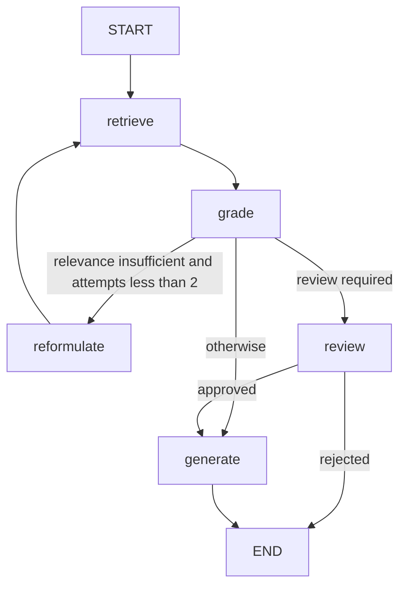

# Module 11: LangGraph RAG

This module builds on the RAG application from Module 10 and models chat as a
checkpointed LangGraph workflow. It adds retrieval retries, query reformulation,
and a human-review interrupt before generation for selected requests.

## Source Map

The application package is `src/rag_app`:

| Area | Responsibility |
| --- | --- |
| `api/` | FastAPI application and routes for chat, retrieval, indexing, upsert, and evaluation |
| `features/` | User-facing workflows: LangGraph RAG chat, LangChain chat, classification, and extraction |
| `chunking/`, `embedding/`, `user_data/` | Document preparation and ingestion |
| `db/`, `retrieval/`, `query/` | Persistence, candidate retrieval/reranking, and query transformations |
| `providers/`, `services/`, `prompts/` | LLM provider adapters and application-level orchestration |
| `models/` | Request, response, and tracker schemas |
| `core/` | Application configuration and settings |
| `observability/`, `tracker/` | Structured logging, tracing, and operation/query tracking |
| `evalution/`, `exceptions/`, `utils/` | Evaluation, error types, and shared helpers |

The primary graph implementation is `src/rag_app/features/rag_langgraph.py`.
The `/rag/chat_answer` API uses the LangGraph workflow; `/rag/chat_answer/stream`
streams graph updates, and `/rag/chat_answer/review` resumes a paused review.

## RAG Graph



`grade` considers retrieval relevant when at least one document has a similarity
score of `0.5` or higher. If not, the graph reformulates and retrieves again,
up to two retrieval attempts. Review is required when the original query
contains `refund`, `delete my account`, or `legal advice`; the graph pauses at
`review`, and generation runs only after approval.

## Checkpointing

The graph state is `RAGGraphState`. The initial state supplies `query`,
`current_query`, `tenant_id`, an empty `retrieved_documents` list, and
`retrieval_attempts = 0`. As nodes run, checkpoints retain the following state:

| State field(s) | What is checkpointed |
| --- | --- |
| `query`, `current_query` | Original user query and its reformulated retrieval query |
| `tenant_id` | Tenant scope used for retrieval |
| `retrieved_documents` | Retrieved text and document metadata; the `operator.add` reducer accumulates results across retries |
| `retrieval_attempts` | Number of retrieval passes, used to cap retries at two |
| `relevance_sufficient`, `category`, `requires_review` | The latest grading and review-routing decision |
| `review_approved` | Human decision returned when resuming the review interrupt |
| `answer`, `sources` | Generated answer and its source documents, or the rejection message |
| `stage` | Most recently completed workflow stage |

LangGraph persists state snapshots and execution position as the graph
progresses. At a review interrupt, the checkpoint lets execution resume at the
paused node without repeating completed retrieval work. Each invocation uses
`tenant_id:session_id` as its `thread_id`, so the review request must use the
same tenant and session identifiers.

`RAGChatLanggraph` defaults to an in-memory saver for local/test use; that state
does not survive process restarts. The API lazily constructs it with
`AsyncPostgresSaver`, whose checkpoints are durable. The PostgreSQL connection
is configured by `DATABASE_CONNECTION_CONVERSATION_URL`.

## Setup

Requirements: Python 3.12+, [uv](https://docs.astral.sh/uv/), and credentials for
the configured LLM provider. PostgreSQL is required for the API's durable graph
checkpoints; `docker-compose.yml` also defines the PostgreSQL and Redis services.

```bash
uv sync --dev
uv run uvicorn rag_app.api.app:app --reload
```

Run the non-integration test suite with:

```bash
uv run pytest
```

The Compose configuration references the external Docker volume
`module-08-vectordb_postgres_data`; create that volume before starting its
PostgreSQL service if it does not already exist.

## Shared Code Across Modules

Module 10 and Module 11 have matching application package layouts and duplicate
common infrastructure, including the settings class and LLM service/provider
integration. A future workspace-level shared package would reduce drift in
stable components such as configuration, provider adapters, common schemas, and
retrieval/embedding interfaces. Keep the LangChain chain and LangGraph state
machine in their respective modules: those workflows are intentionally
framework-specific. Extract shared components behind tested interfaces, then
update both modules to depend on that package rather than importing one module's
application package from the other.
